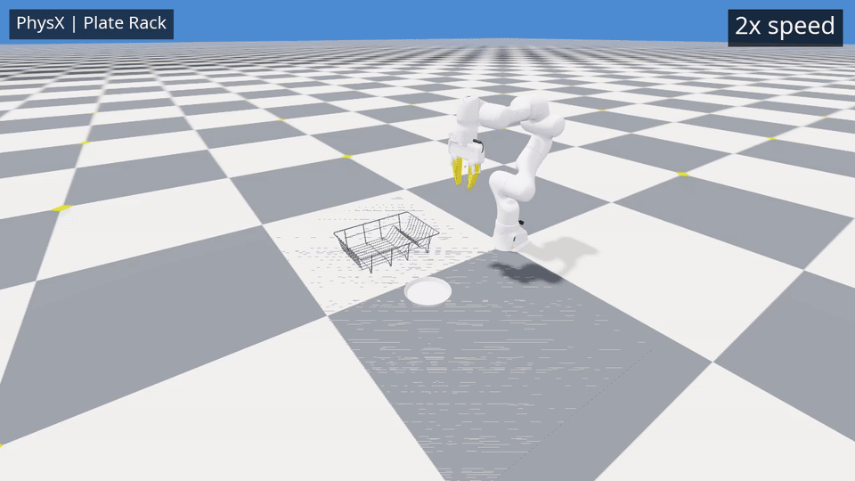

## Zero teleop datagen with Newton

Run from the repository root:

```bash
OMNI_KIT_ACCEPT_EULA=YES uv run --project deps/isaaclab --no-sync python -m datagen.run \
  --backend newton --mode replay --video --settle_seconds 10 --require_success \
  --output logs/plate_rack/newton
```

Output: `logs/plate_rack/newton/plate_rack_newton.mp4`.

## Zero teleop datagen with PhysX

```bash
OMNI_KIT_ACCEPT_EULA=YES uv run --project deps/isaaclab --no-sync python -m datagen.run \
  --backend physx --mode replay --video --settle_seconds 10 --require_success \
  --output logs/plate_rack/physx
```

Output: `logs/plate_rack/physx/plate_rack_physx.mp4`.


